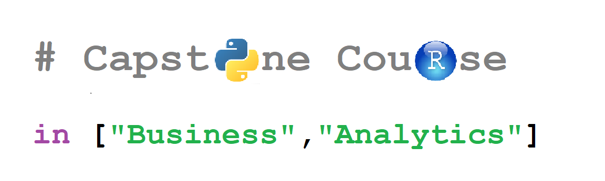

# QMB6912S23

### QMB6912: Capstone Project in Business Analytics

### Spring Semester 2023

In this course, learners will integrate all the tools developed in the program 
to solve an empirical problem.

At the end of the course, students will be able: 
1. to formulate the appropriate empirical questions to ask 
for a particular problem in business analytics; 

1. to evaluate answers to those questions in light of relevant data; 

1. to replicate the empirical work of others, using data provided; 

1. to automate these tasks in a way that applies to large-scale business problems.

