# Graphics in R

# Basic Graphs

This demonstration is a selection of graphing methods from
Chapter 6 of R in Action by Robert I. Kabacoff,
called "Basic Graphs".

Often, your data include categorical variables
and the ```vcd``` package is designed for
*Visualizing Categorical Data*.

```R
# Load vcd package
library(vcd)
```

Let's use this package to analyze the Arthritis dataset.
This dataset is used to determine whether a given ```Treatment```
```Improved``` the patient's condition.

```R
> summary(Arthritis)
       ID       Treatment      Sex          Age       Improved 
 Min.   : 1   Placebo:43   Female:59   Min.   :23   None  :42  
 1st Qu.:22   Treated:41   Male  :25   1st Qu.:46   Some  :14  
 Median :42                            Median :57   Marked:28  
 Mean   :42                            Mean   :53              
 3rd Qu.:63                            3rd Qu.:63              
 Max.   :84                            Max.   :74      
 ```

First, we'll get the cell counts for the ```"Improved"``` variable
using the ```table()``` function.

```R
> counts <- table(Arthritis$Improved)
> counts

  None   Some Marked 
    42     14     28 
```


This shows the number of observations with the "Improved"
variable in each of three categories.


## Listing 6.1 - Simple bar plot


The first step in any analysis is to create a simple bar plot
of the dependent variable.
```R
barplot(counts, main = "Simple Bar Plot", xlab = "Improvement",
    ylab = "Frequency")
```

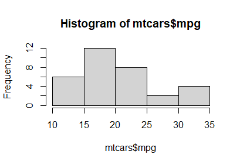

For variables with few categories, often a
horizontal bar plot offers a better visualization.

```R
barplot(counts, main = "Horizontal Bar Plot", xlab = "Frequency",
    ylab = "Improvement", horiz = TRUE)
```
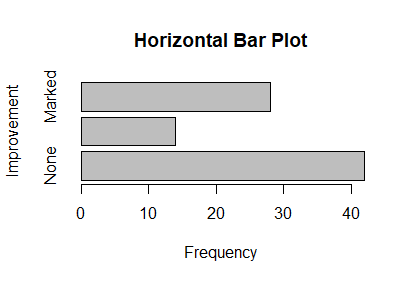


The only difference in syntax is the ```horiz = TRUE``` argument.


So far, we have analyzed one variable at a time.
Now consider how the ```Improved``` outcome varies with the ```Treatment```.
When two variables are passed to the ```table()``` function,
it tabulates a two-dimensional table of counts.

```R
> counts <- table(Arthritis$Improved,
+ Arthritis$Treatment)
> counts
        
         Placebo Treated
  None        29      13
  Some         7       7
  Marked       7      21
```

We can already see higher counts in the ```None``` column
for the ```Placebo``` group and many patients
with ```Marked``` Improvement in the ````Treated``` group.


## Listing 6.2 - Stacked and grouped bar plots

Bar plots offer several options for plotting
two-dimensional data.

A stacked barplot is one option.

```R
barplot(counts, main = "Stacked Bar Plot",
        xlab = "Treatment", ylab = "Frequency",
        col = c("red", "yellow", "green"),
        legend.text = rownames(counts))
```
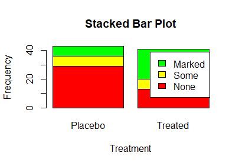

Note that the legend might be inconveniently placed
by default. You may have to pass some arguments to
alter the placement of the legend.

```R
barplot(counts, main = "Stacked Bar Plot",
        xlab = "Treatment", ylab = "Frequency",
        col = c("red", "yellow", "green"),
        legend.text = rownames(counts),
        args.legend = list(x = "topright" ,
                           inset = c(- 0.10, -0.6),
                           cex = 0.75,
                           ncol = 1))
```


This looks good in the plot window,
however, sometimes other adjustments are
necessary when saving it to a file.


A grouped barplot is another option
to plot two-dimensional categorical data.
```R
barplot(counts, main = "Grouped Bar Plot",
        xlab = "Treatment", ylab = "Frequency",
        col = c("red", "yellow", "green"),
        beside = TRUE,
        legend.text = rownames(counts),
        args.legend = list(x = "topright" ,
                           inset = c(- 0.10, -0.6),
                           cex = 0.75,
                           ncol = 1))
```
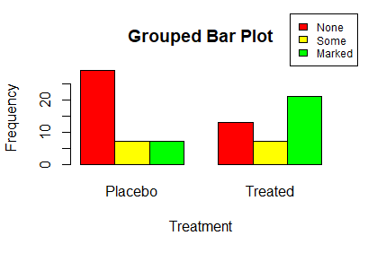


## Listing 6.3 - Mean bar plots

Now let's revisit a dataset with characteristics by US states.

We'll draw two variables from the data frame.
```R
states <- data.frame(state.region, state.x77)
```
Now we can calculate the mean Illiteracy rate by region.

```R
> means <- aggregate(states$Illiteracy,
+     by = list(state.region),
+     FUN = mean)
> means
        Group.1   x
1     Northeast 1.0
2         South 1.7
3 North Central 0.7
4          West 1.0
```
It helps to sort the means in order.
```R
> means <- means[order(means$x), ]
> means
        Group.1   x
3 North Central 0.7
1     Northeast 1.0
4          West 1.0
2         South 1.7
```

Now this table is in shape for a barplot.

```R
barplot(means$x, names.arg = means$Group.1)
title("Mean Illiteracy Rate")
```
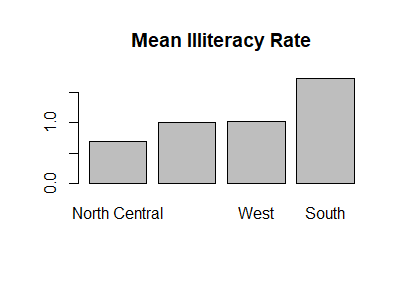


## Listing 6.4 - Fitting labels in bar plots

Moving back to the Arthritis treatment data,
we can go back to a one-dimensional table,
but this time add notes to the table.

First, adjust the margins of the graph.
```R
par(mar = c(5, 8, 4, 2))
par(las = 2)
counts <- table(Arthritis$Improved)

barplot(counts, main = "Treatment Outcome",
        horiz = TRUE,
        cex.names = 0.8,
        names.arg = c("No Improvement",
                      "Some Improvement",
                      "Marked Improvement"))
```


This allows you to skip the chore of
fooling around with the legend.


## Section --6.1.5 Spinograms--

A spinogram is a stacked bar plot in which
the height of each bar is one
and the segment heights represent proportions.

```R
library(vcd)
```
As above, we can attach the Arthritis data
to allow us to refer to the variables by name.
```R
attach(Arthritis)
counts <- table(Treatment, Improved)
spine(counts, main = "Spinogram Example")
detach(Arthritis)
```


## Listing 6.5 - Pie charts

The statistical community largely does not favor pie charts,
which is partly the reason for limited functionality for pie charts.
The psychological justification for this is that
people are able to judge lengths better than volume.
Nevertheless, pie charts are common in business, so
we will work through some examples.

Let's start with a simple example.
```R
slices <- c(10, 12, 4, 16, 8)
lbls <- c("US", "UK", "Australia", "Germany", "France")

pie(slices, labels = lbls, main = "Simple Pie Chart")
```
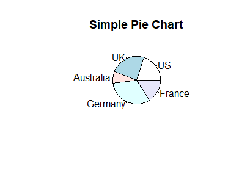

We can add percentages as labels by calculating
the percentages and pasting them into a vector.
```R
pct <- round(slices/sum(slices) * 100)
lbls2 <- paste(lbls, " ", pct, "%", sep = "")

pie(slices, labels = lbls2, col = rainbow(length(lbls)),
    main = "Pie Chart with Percentages")
```


For added effect, one can plot the pie chart in
three dimensions.

```R
library(plotrix)
pie3D(slices, labels = lbls, explode = 0.1, main = "3D Pie Chart ")
```


As with a barplot, you can plot a pie chart
from a table.

```R
mytable <- table(state.region)
lbls <- paste(names(mytable), "\n", mytable, sep = "")
pie(mytable, labels = lbls,
    main = "Pie Chart from a Table\n (with sample sizes)")
```
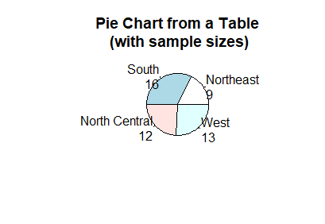


We added the table into the labels.


## Fan plots

Some people find a fan plot to be more visually
appealing than a pie chart, even though it carries
the same information.

```R
library(plotrix)
slices <- c(10, 12, 4, 16, 8)
lbls <- c("US", "UK", "Australia", "Germany", "France")
fan.plot(slices, labels = lbls, main = "Fan Plot")
```


## Listing 6.6 - Histograms

We have seen histograms before.

The standard histogram is simple to create
and is good for quick analysis.

```R
hist(mtcars$mpg)
```
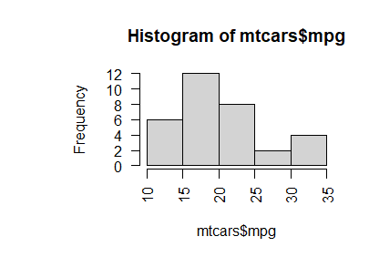

For a histogram that you would add to a report,
you can overwrite the default features.
```R
hist(mtcars$mpg, breaks = 12, col = "red",
    xlab = "Miles Per Gallon",
    main = "Colored histogram with 12 bins")
```
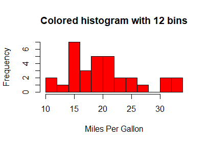

The ```lines()``` command will append a line to an
existing plot.
Use it to plot a density curve.
```R
hist(mtcars$mpg, freq = FALSE, breaks = 12, col = "red",
    xlab = "Miles Per Gallon",
    main = "Histogram, rug plot, density curve")
rug(jitter(mtcars$mpg))
lines(density(mtcars$mpg), col = "blue", lwd = 2)
```


The rug command adds a plot of the location of
observations to augment the density plot.

With some additional calculation,
you can superimpose a normal curve
over the histogram.

```R
x <- mtcars$mpg
h <- hist(x, breaks = 12, col = "red",
    xlab = "Miles Per Gallon",
    main = "Histogram with normal curve and box")
xfit <- seq(min(x), max(x), length = 40)
yfit <- dnorm(xfit, mean = mean(x), sd = sd(x))
yfit <- yfit * diff(h$mids[1:2]) * length(x)
lines(xfit, yfit, col = "blue", lwd = 2)
box()
```
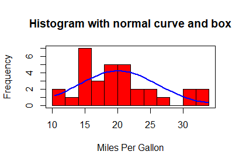

Some like to enclose the histogram in a ```box()```.


## Listing 6.7 - Kernel density plot

A histogram is a simple form of a class of models
called nonparametric models (there are no parameters,
such as slope coefficients to estimate).
One step further is to plot a smoothed curve
approximating the density of the distribution.

The density function is designed for this purpose.

```R
d <- density(mtcars$mpg)
plot(d)
```
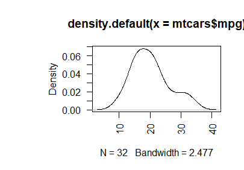

As with all graphs, one can specify additional features.
In this case, the density plot is created first,
assigned to the variable ```d```,
and passed as an argument to the plot function.

```R
d <- density(mtcars$mpg)
plot(d, main = "Kernel Density of Miles Per Gallon")
polygon(d, col = "red", border = "blue")
rug(mtcars$mpg, col = "brown")
```
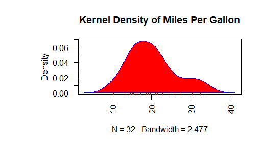

For additional decoration, you can paint the
shape of the plot and add a rug for the observations.


## Listing 6.8 - Comparing kernel density plots

Perhaps you want to compare two distributions
on one plot. The ```sm``` packages offers more options
for calculating smoothed curves.

```R
library(sm)
```

Set thicker line width for all plots.
```R
par(lwd = 2)
```
Take a sample from the mtcars dataset.
```R
attach(mtcars)
```
Now plot the densities of miles per gallon,
on for each category of number of cylinders.
```R
sm.density.compare(mpg, cyl, xlab = "Miles Per Gallon")
title(main = "MPG Distribution by Car Cylinders")
```


Convert the number of cylinders to a factor
to annotate the graphs.
```R
cyl.f <- factor(cyl, levels = c(4, 6, 8),
                labels = c("4 cylinder", "6 cylinder", "8 cylinder"))
colfill <- c(2:(2 + length(levels(cyl.f))))
```

Now we're getting fancy:
you can use the ```locator()``` function to ask you
to point to a location in your plot window.
```R
cat("Use mouse to place legend...", "\n\n")
legend(locator(1), levels(cyl.f), fill = colfill)
```
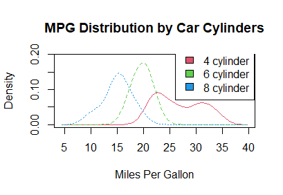


Detach the data and reset the line widths.
```R
detach(mtcars)
par(lwd = 1)
```


