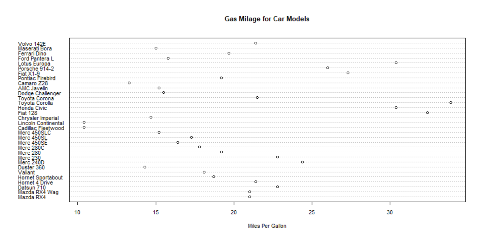
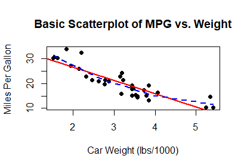
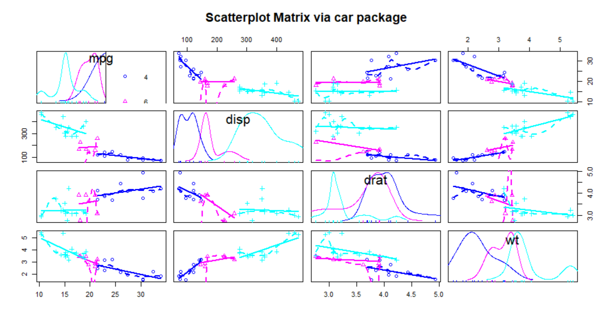
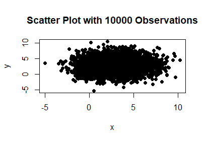

# Graphics in R

# Graphs for Multivariate Data

This demonstration is a continuation of graphing methods from
Chapter 6 of R in Action by Robert I. Kabacoff,
called "Basic Graphs" and we move on to Chapter 11
called "Intermediate Graphs".

## --Section 6.5--

A boxplot is also useful to compare distributions
of a continuous variable across different categories.

```R
boxplot(mpg ~ cyl, data = mtcars,
    main = "Car Milage Data",
    xlab = "Number of Cylinders",
    ylab = "Miles Per Gallon")
```


## Listing 6.9 - Box plots for two crossed factors

The same logic applies to the case with
two explanatory factors.

Define two categorical variables as factors:
number of cylinders and transmission type.
```R
mtcars$cyl.f <- factor(mtcars$cyl, levels = c(4, 6,
    8), labels = c("4", "6", "8"))
mtcars$am.f <- factor(mtcars$am, levels = c(0, 1),
    labels = c("auto", "standard"))
```

Now draw the boxplot by specifying
the formula as you would for a regression
of mpg on the interaction of ```am.f``` and ```cyl.f```.
```R
boxplot(mpg ~ am.f * cyl.f, data = mtcars,
    varwidth = TRUE, col = c("gold", "darkgreen"),
    main = "MPG Distribution by Auto Type",
    xlab = "Auto Type")
```


## Listing 6.10 - Violin plots

For the connoisseur, the violin plot
offers a sophisticated approach to plotting
densities across categories.

```R
library(vioplot)
x1 <- mtcars$mpg[mtcars$cyl == 4]
x2 <- mtcars$mpg[mtcars$cyl == 6]
x3 <- mtcars$mpg[mtcars$cyl == 8]
vioplot(x1, x2, x3,
    names = c("4 cyl", "6 cyl", "8 cyl"),
    col = "gold")
title("Violin Plots of Miles Per Gallon")
```


A violin plot is a combination of a boxplot and a
density plot for each category.
The white dot is the median,
the black column represents the interquartile range,
and the vertical line shows the whiskers as in a boxplot.
The boxplot is cased in a kernel density estimate of
the distribution.


## --Section 6.6--

A dot chart is the categorical analogue to
a scatterplot.

```R
dotchart(mtcars$mpg, labels = row.names(mtcars),
    cex = 0.7,
    main = "Gas Milage for Car Models",
    xlab = "Miles Per Gallon")
```


## Listing 6.11 - sorted colored grouped dot chart

A dot chart can be augmented by
using colors to represent categories
and by sorting the data by gas mileage
to create a better visualization.

```R
# Sort the data first.
x <- mtcars[order(mtcars$mpg), ]
# Create a factor and assign color names
# by the levels of the factor.
x$cyl <- factor(x$cyl)
x$color[x$cyl == 4] <- "red"
x$color[x$cyl == 6] <- "blue"
x$color[x$cyl == 8] <- "darkgreen"
# Now plot the dotchart.
dotchart(x$mpg, labels = row.names(x), cex = 0.7,
    pch = 19, groups = x$cyl,
    gcolor = "black", color = x$color,
    main = "Gas Milage for Car Models\ngrouped by cylinder",
    xlab = "Miles Per Gallon")
```


# Intermediate Graphs

If you have followed this far,
perhaps you'll take a step further.

## Listing 11.1 - A scatterplot with best fit lines

You can augment plots with estimates from
statistical models.
This example adds a linear regression line
and a smoothed estimate of the relationship
with the ```lowess()``` function to implement a
locally weighted regression.
```R
attach(mtcars)
plot(wt, mpg,
     main="Basic Scatterplot of MPG vs. Weight",
     xlab="Car Weight (lbs/1000)",
     ylab="Miles Per Gallon ", pch=19)
abline(lm(mpg ~ wt), col="red", lwd=2, lty=1)
lines(lowess(wt, mpg), col="blue", lwd=2, lty=2)
```



## Scatterplot matrices

You might want to quickly inspect several scatterplots
for a small set of variables.
The ```pairs()``` function calculates a scatterplot
for each pair of variables.
```R
pairs(~ mpg + disp + drat + wt, data=mtcars,
      main="Basic Scatterplot Matrix")
```


But why stop there?
With the ```lty.smooth=2``` argument, you can add
smoothed model fits between each pair of variables,
with density plots of each variable on the diagonal.
```R
library(car)
scatterplotMatrix(~ mpg + disp + drat + wt, data=mtcars, spread=FALSE,
    lty.smooth=2, main="Scatterplot Matrix via car package")
```


And because, when graphing in R, enough is never enough,
you can color code the plots by a specified category,
in this case, separated by number of cylinders.
```R
scatterplotMatrix(~ mpg + disp + drat + wt | cyl, data=mtcars, spread=FALSE,
    main="Scatterplot Matrix via car package", diagonal="histogram")
```



For the numerically-oriented, a correlation matrix
captures the relationships.
```R
> cor(mtcars[c("mpg", "wt", "disp", "drat")])
       mpg    wt  disp  drat
mpg   1.00 -0.87 -0.85  0.68
wt   -0.87  1.00  0.89 -0.71
disp -0.85  0.89  1.00 -0.71
drat  0.68 -0.71 -0.71  1.00
```


## Listing 11-2 Scatter plot matrix produced with the ```gclus``` package

The ```gclus``` package can produce a scatterplot matrix with
what you might agree is a more pleasing color scheme.

```R
library(gclus)
mydata <- mtcars[c(1,3,5,6)]
mydata.corr <- abs(cor(mydata))
mycolors <- dmat.color(mydata.corr)
myorder <- order.single(mydata.corr)
cpairs(mydata,
    myorder,
    panel.colors=mycolors,
    gap=.5,
    main="Variables Ordered and Colored by Correlation"
)
```


## High-density scatterplots

For this example, we will generate some random data.
```R
set.seed(1234)
n <- 10000
c1 <- matrix(rnorm(n, mean=0, sd=.5), ncol=2)
c2 <- matrix(rnorm(n, mean=3, sd=2), ncol=2)
mydata <- rbind(c1, c2)
mydata <- as.data.frame(mydata)
names(mydata) <- c("x", "y")
```
Another method to produce a scatterplot is
with the ```with()``` function.
```R
with(mydata,
    plot(x, y, pch=19,
         main="Scatter Plot with 10000 Observations"))
```


This syntax allows you to reference the names of variables
in the object passed to the ```with()``` function,
much like what happens when we ```attach()``` and ```detach()``` an object.

With so many points, covering most of the area,
it is difficult to tell the density.

A ```smoothScatter``` plot represents the density with
the intensity of the hue and augments the periphery
with plots of some outlying observations.
```R
with(mydata,
    smoothScatter(x, y,
                  main="Scatterplot with Smoothed Density"))
```


The ```hexbin``` package produces a color-coded scattergraph
by separating the region into hexagonal shapes.
```R
library(hexbin)
with(mydata, {
    bin <- hexbin(x, y, xbins=50)
    plot(bin, main="Hexagonal Binning (10,000 Observations)")
    })
```


The opaquely-named ```IDPmisc``` package can be used to plot
an illuminating scattergraph with a color scale to indicate density.
```R
library(IDPmisc)
with(mydata,
    iplot(x, y, main="Image Scatter Plot with Color Indicating Density"))
par(opar)
```


## 3-D Scatterplots

If you are interested in three-dimensional data,
you can still plot a scattergraph.
```R
library(scatterplot3d)
attach(mtcars)
scatterplot3d(wt, disp, mpg,
     main="Basic 3D Scatterplot")
```


However, for many analysts, it is difficult to
visualize the locations...
...unless the locations are represented with vertical lines.
```R
scatterplot3d(wt, disp, mpg,
    pch=16,
    highlight.3d=TRUE,
    type="h",
    main="3D Scatterplot with Vertical Lines")
```


If you've followed this far,
why not augment your 3-D scatter plot with
a plot of the regression plane?
```R
s3d <-scatterplot3d(wt, disp, mpg,
    pch=16,
    highlight.3d=TRUE,
    type="h",
    main="3D Scatter Plot with Verical Lines and Regression Plane")
# Fit a regression model.
fit <- lm(mpg ~ wt+disp)
# Add it to the plot object s3d created above.
s3d$plane3d(fit)

# Clean up after finishing.
detach(mtcars)
```


## Spinning 3D plot

It is often difficult to visualize 3-D data
on a 2-D surface. The ```rgl``` package has the function
```plot3d``` that renders the scatterplot in a separate window.
```R
library(rgl)
attach(mtcars)
plot3d(wt, disp, mpg, col="red", size=5)
```


You can interact with this plot by dragging your mouse
to move the plot around and see the view from different angles.


A similar interactive plot is available from the 
```scatter3d``` function in the ```Rcmdr```. 
```R
rgl.open()
library(Rcmdr)
attach(mtcars)
scatter3d(wt, disp, mpg)
```
RStudio may prompt you to install a number of 
packages to render the graph
but once you see it, you can drag the figure 
with your mouse and rotate it to 
see the data from all angles.


## Bubble plots

A bubble plot allows you to visualize the value of a third variable
while plotting the data on another two dimensions.
This figure plots gas mileage against the weight of a car,
with the size of the bubbles indicating the displacement of the engine.

```R
attach(mtcars)
r <- sqrt(disp/pi)
symbols(wt, mpg, r, inches=0.30, fg="white", bg="lightblue",
main="Bubble Plot with point size proportional to displacement",
ylab="Miles Per Gallon",
xlab="Weight of Car (lbs/1000)")
text(wt, mpg, rownames(mtcars), cex=0.6)
detach(mtcars)
par(opar)
```


## Listing 11.3 - Creating side-by-side scatter and line plots

The dataset ```Oranges``` contains observations of the
circumference and ages for a sample of five orange trees.
The ```mfrow``` argument in the ```par``` function
sets the graphical parameters to plot
two scattergraphs side-by-side,
one for each orange tree.

```R
par(mfrow=c(1,2))
t1 <- subset(Orange, Tree==1)
plot(t1$age, t1$circumference,
    xlab="Age (days)",
    ylab="Circumference (mm)",
    main="Orange Tree 1 Growth")
t2 <- subset(Orange, Tree==2)
plot(t2$age, t2$circumference,
    xlab="Age (days)",
    ylab="Circumference (mm)",
    main="Orange Tree 2 Growth",
    type="b")
par(opar)
```


## Listing 11.4 -  Line chart displaying the growth of 5 Orange trees over time

For plots with multiple parameters, it often helps to
Create blank axes first and then add the plots.

Calculate the parameters for the plot axes.
```R
Orange$Tree <- as.numeric(Orange$Tree)
ntrees <- max(Orange$Tree)

xrange <- range(Orange$age)
yrange <- range(Orange$circumference)
```

The ```type = "n"``` argument tells R to plot nothing:
Leave the plot blank to be filled in later.
```R
plot(xrange, yrange,
    type="n",
    xlab="Age (days)",
    ylab="Circumference (mm)"
 )
```

Next, determine the color scheme, line type
and plot character numbers in vectors,
each with five elements,
one for each tree in the ```Oranges``` dataset.
```R
colors <- rainbow(ntrees)
linetype <- c(1:ntrees)
plotchar <- seq(18, 18+ntrees, 1)
```
Now loop through the tree numbers.
```R
for (i in 1:ntrees) {
    tree <- subset(Orange, Tree==i)
    lines(tree$age, tree$circumference,
        type="b",
        lwd=2,
        lty=linetype[i],
        col=colors[i],
        pch=plotchar[i]
    )
}
```
Add a title and legend to complete the picture.

```R
title("Tree Growth", "example of line plot")

legend(# 'topright',
  xrange[1], yrange[2],
    legend = 1:ntrees,
    cex=0.75,
    col=colors,
    pch=plotchar,
    lty=linetype,
    title="Tree"
    )
```


## Correlograms

R has many options for the enthusiastic
data visualizer.
You might think that the following examples take
data visualization too far.

```R
options(digits=2)
cor(mtcars)

library(corrgram)
corrgram(mtcars, order=TRUE, lower.panel=panel.shade,
    upper.panel=panel.pie, text.panel=panel.txt,
    main="Correlogram of mtcar intercorrelations")

corrgram(mtcars, order=TRUE, lower.panel=panel.ellipse,
    upper.panel=panel.pts, text.panel=panel.txt,
    diag.panel=panel.minmax,
    main="Correlogram of mtcar data using scatterplots and ellipses")

corrgram(mtcars, lower.panel=panel.shade,
    upper.panel=NULL, text.panel=panel.txt,
    main="Car Mileage Data (unsorted)")

col.corrgram <- function(ncol){
    colorRampPalette(c("darkgoldenrod4", "burlywood1",
                                     "darkkhaki", "darkgreen"))(ncol)}


corrgram(mtcars, order=TRUE, lower.panel=panel.shade,
    upper.panel=panel.pie, text.panel=panel.txt,
    main="A Corrgram (or Horse) of a Different Color")
```
Plot them and decide for yourself.


## Figure 11.18

This set of figures demonstrates a way to
plot several figures by splitting the "Plot"
pane into eight sections on a 2x4 grid.

This set of figures also plots examples of several
options for the argument ```"type"```
in the ```plot()``` and ```lines()``` functions

```R
# Create the two series.
x <- c(1:5)
y <- c(1:5)
# Split the "Plot" pane into a 2x4 grid.
par(mfrow=c(2,4))
# Generate a list of type options for the plots.
types <- c("p", "l", "o", "b", "c", "s", "S", "h")
for (i in types){
    plottitle <- paste("type=", i)
    plot(x,y,type=i, col="red", lwd=2, cex=1, main=plottitle)
}
```


## Mosaic Plots

This final figure plots the fates of passengers on the
cruise ship Titanic.
It plots the proportion of passengers who survived
among the sex, age and the different classes of passengers.

```R
ftable(Titanic)
library(vcd)
mosaic(Titanic, shade=TRUE, legend=TRUE)
```


A tragic ending for some but an impressive
set of plotting options for us.

